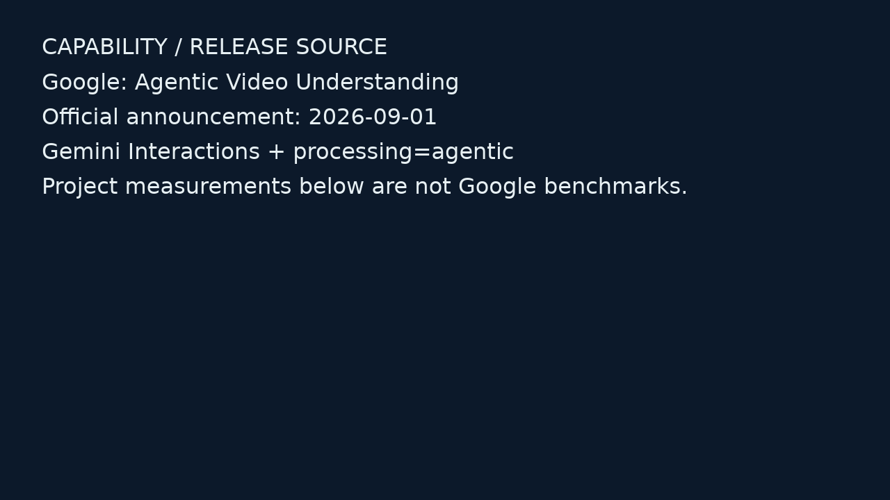
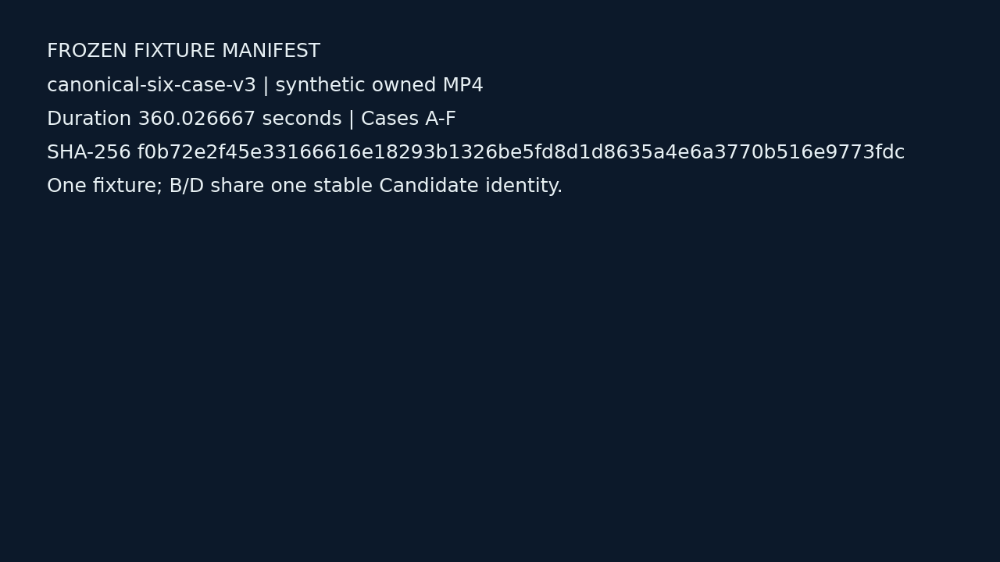
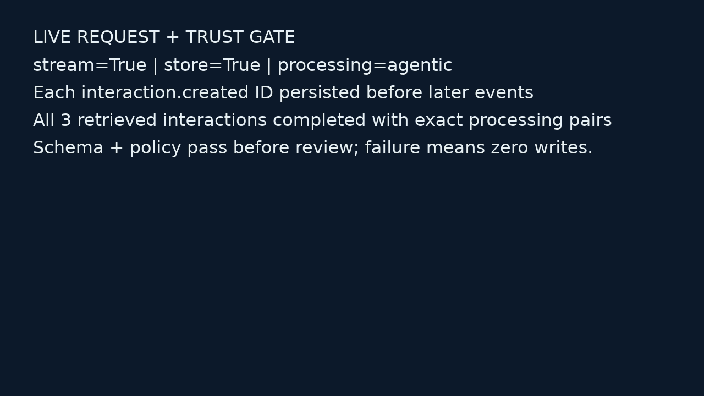
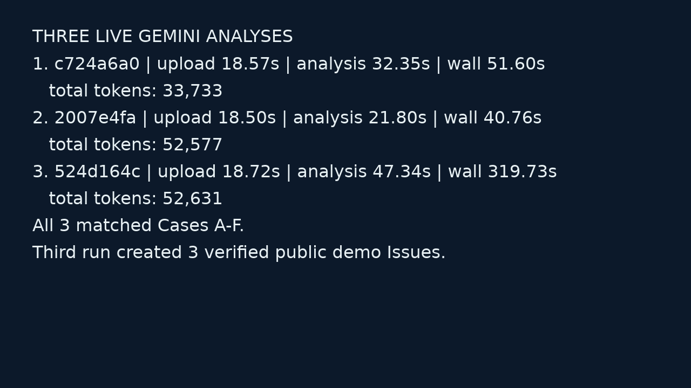
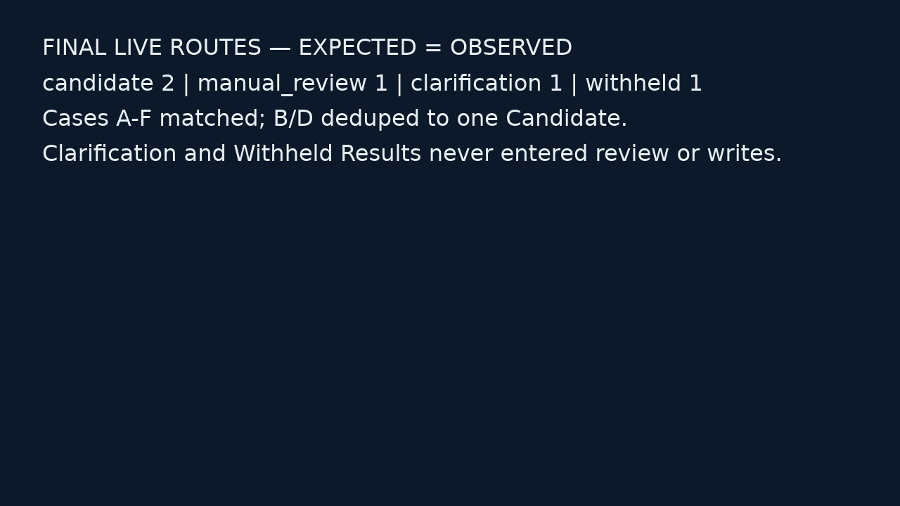
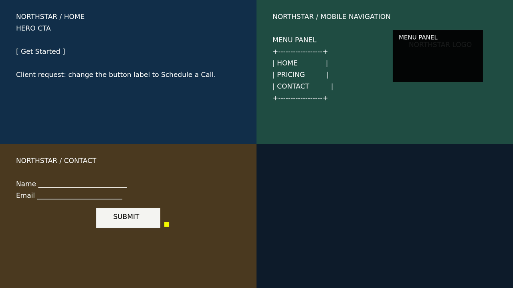
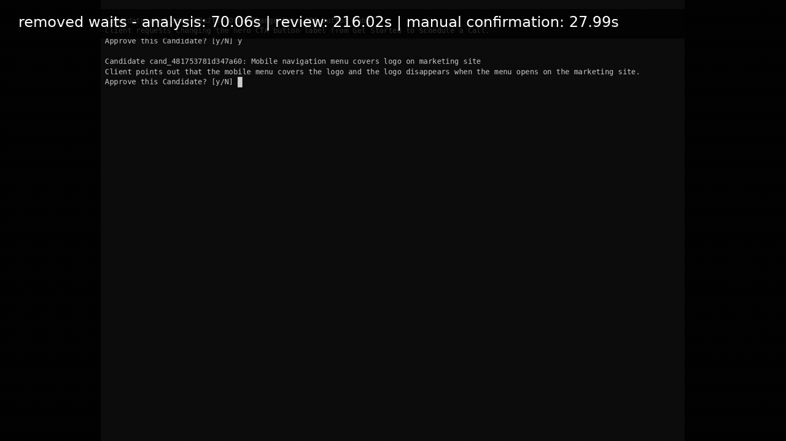
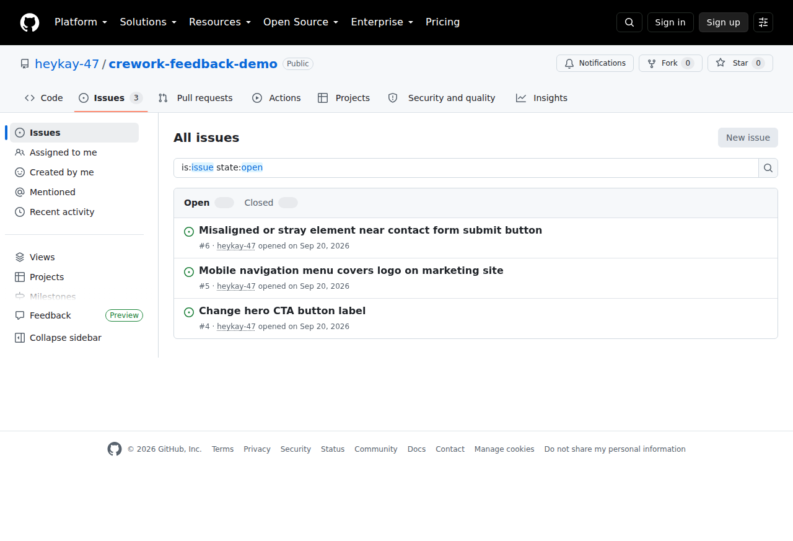
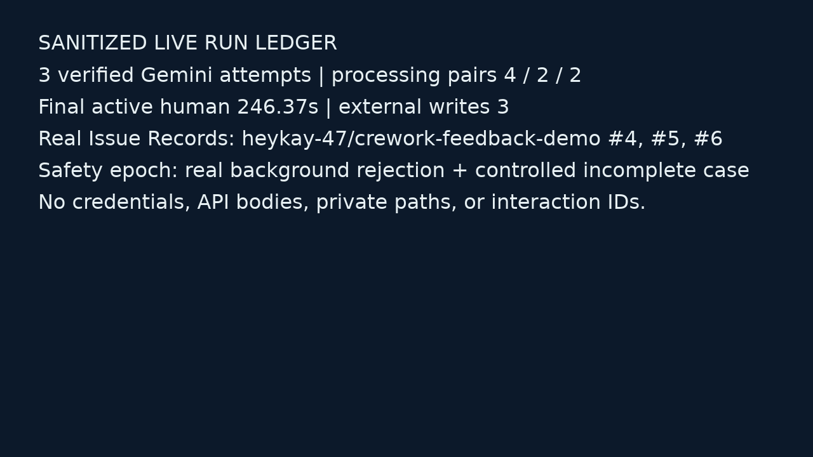
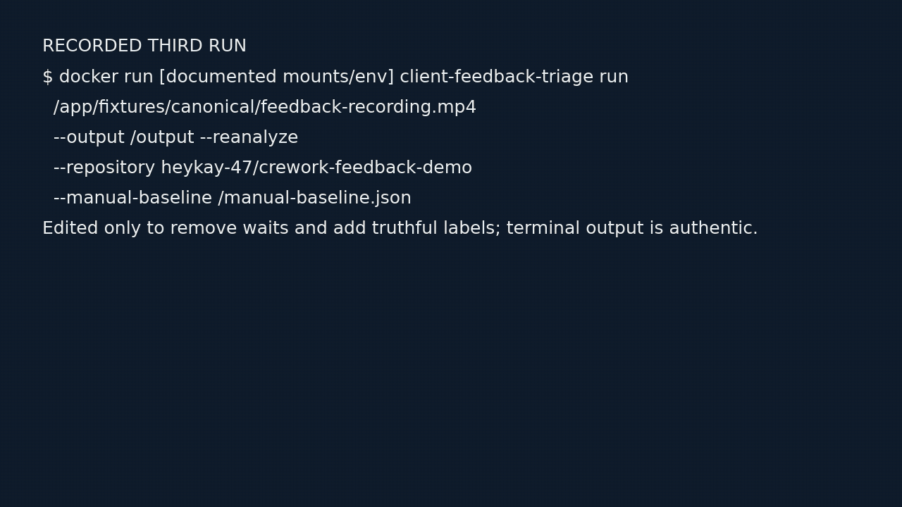

# Client Feedback Triage Agent

## The one-line result

This is a small, direct-API Python workflow that turns one synthetic client
screen recording into timestamped, policy-routed work candidates. It keeps
uncertainty visible, requires human approval before external writes, and leaves
an atomic Run Ledger.

**Evidence boundary:** the checked-in proof package was built from three fresh
live `gemini-3.5-flash-lite` analyses of one owned synthetic fixture. The third
run created three approved Issues in the dedicated public demo repository
[`heykay-47/crework-feedback-demo`](https://github.com/heykay-47/crework-feedback-demo/issues).
The deterministic scorer validates those live results against authored ground
truth; it is not a substitute gateway. The package step itself remains
read-only and performs no Gemini or GitHub call.

## 1. Capability matched to an operational pain

### Capability

Google announced **Agentic Video Understanding** on **2026-09-01**. Unlike
uniform fixed-rate sampling, agentic processing can inspect relevant video
moments, including frames, audio and transcript, in response to the task.

- [Official launch announcement (Google, 2026-09-01)](https://blog.google/innovation-and-ai/models-and-research/gemini-models/introducing-agentic-video-in-gemini/)
- [Gemini video understanding](https://ai.google.dev/gemini-api/docs/video-understanding)
- [Interactions API](https://ai.google.dev/gemini-api/docs/interactions)
- [Official pricing](https://ai.google.dev/gemini-api/docs/pricing)

Google's launch article reports **up to** 88% fewer tokens, 66% lower cost and
7% higher quality in its own comparisons. Those are Google-reported maxima,
not this project's benchmark, ROI, or promise for a six-minute recording.

### Pain

For a 50–300-person agency or product team, a client recording mixes bugs,
copy changes, questions, decisions, vague reactions, duplicate mentions and
visual behavior that is never stated precisely. A PM, account manager,
designer or engineer must watch the whole recording, understand speech and UI
state, find timestamps, deduplicate, write Issues and ask for clarification.
That translation work delays the feedback-to-execution loop.

### Why both spoken and visual context matter

Transcript-only processing may capture “the logo is wrong” but miss which logo,
which screen, what it overlaps, or what the client pointed at. Conversely, a
model may see a submit-button anomaly without knowing whether the client wants
it changed. The useful input is:

```text
spoken intent + visible UI state + timestamp
                    ↓
       grounded observation / candidate
```

This workflow therefore stores client quotes and visual observations as
separate evidence, rather than treating a transcript summary as a Candidate.

## 2. Compact architecture and guarded workflow

```text
synthetic MP4 + project context
          │
          ▼
one-shot CLI ── hash + FFprobe + behavior fingerprint
          │
          ▼
Gemini Interactions: video processing="agentic"
stream=True, store=True; persist interaction.created
          │
          ▼
retrieve the exact stored interaction
status=completed + matched processing pairs + Pydantic schema
          │
          ▼
deterministic policy: dedupe, timestamp checks, confidence/intent routes
          │
          ▼
FFmpeg Evidence Frames → terminal review → immutable Approval
          │                                           │
          └────────────── atomic Run Ledger ◄─────────┘
                                                      │
                                                      ▼
                                          verified GitHub Issue adapter
```

The operational fast path is:

1. `analyze` records a completed, verified result.
2. `analyze --reanalyze` records a fresh qualifying result.
3. `run --reanalyze` records the third result, extracts frames, asks for
   approval and may publish only approved outcomes.
4. The read-only `package` command freezes the passed cycle into the public
   proof bundle; it does not call Gemini or GitHub.

The package's [manifest](docs/submission/proof-bundle/manifest.json),
[claim index](docs/submission/proof-bundle/claim-index.json) and
[sanitized ledger](docs/submission/proof-bundle/ledger.json) are the visible
record of that contract.

### Perception → interpretation → execution

Agentic video improves perception and retrieval; it does not guarantee the
correct interpretation of client intent. The system keeps three decisions
separate:

```text
PERCEPTION       What happened / what was shown?
       ↓
INTERPRETATION   What does the client appear to mean?
       ↓
EXECUTION        Is it clear and safe enough to create work?
```

Gemini proposes grounded Observations. Pydantic and deterministic policy check
shape, timestamps, intent, duplicates and confidence. Approval and the write
coordinator control execution. A visual-only anomaly is never silently turned
into a requested change.

## 3. Expected versus observed: all six cases, three analyses

The fixture is the owned synthetic `canonical-six-case-v3` recording:
[fixture manifest](docs/submission/proof-bundle/images/02-fixture-manifest.png),
[deterministic report](docs/submission/proof-bundle/deterministic-report.json),
and [sanitized ledger](docs/submission/proof-bundle/ledger.json). “Run 1–3”
below means the three qualifying live Gemini analyses persisted by the exact
acceptance sequence.

| Case | Expected route | Run 1 observed | Run 2 observed | Run 3 observed |
|---|---|---|---|---|
| A — explicit hero CTA copy change | Candidate; explicit change; `cand_2c8c489a2f60f030` | Candidate | Candidate | Candidate |
| B — spoken + visible mobile navbar overlap | Candidate; bug; evidence frame; `cand_481753781d347a60` | Candidate | Candidate | Candidate |
| C — vague pricing reaction | Clarification Request; ask what should change | Clarification Request | Clarification Request | Clarification Request |
| D — repeated navbar overlap on dashboard | Same Candidate as B; deduplicate | Candidate, merged with B | Candidate, merged with B | Candidate, merged with B |
| E — analytics tracking question | Withheld Result; `question_not_request` | Withheld | Withheld | Withheld |
| F — visual-only contact-submit anomaly | Manual Review; visually inferred; evidence frame | Manual Review | Manual Review | Manual Review |

The [report](docs/submission/proof-bundle/deterministic-report.json) records
all six matched authored cases. The [six-routes frame](docs/submission/proof-bundle/images/05-six-routes.png)
shows the compact route result; the [Evidence Frames](docs/submission/proof-bundle/evidence-frames/)
show the final actionable visual context.

## 4. Safety invariants and tested failure behavior

These are behavior claims, not aspirations. The [claim index](docs/submission/proof-bundle/claim-index.json)
links each proof claim to its artifact and check.

- **Source identity:** the source SHA-256, fixture version and behavior
  fingerprint must match the current ledger. A changed fingerprint starts a
  new epoch; old attempts are not silently reused.
- **Recoverable model execution:** persist the `interaction.created` ID;
  retrieve that exact ID after interruption; never blindly start another
  attempt when execution status is unknown.
- **Completed output only:** accept only `status == completed`, matched
  processing-call/result pairs, non-empty Gemini usage and schema-valid JSON.
  Stream deltas are diagnostics, never policy input or write input.
- **Semantic boundary:** timestamp ranges are checked against the actual video
  duration; malformed output or policy contradictions settle the attempt as a
  failure and emit no routes.
- **Deterministic routing:** questions and commentary are Withheld, ambiguous
  reactions are Clarification Requests, visual/medium-confidence items go to
  Manual Review, and only clear high-confidence changes/problems are
  approval-eligible Candidates.
- **Evidence before action:** required Evidence Frames are extracted and
  persisted before review. A failed extraction remains visible and cannot be
  mistaken for grounded evidence.
- **Approval is not eligibility:** Clarification Requests and Withheld Results
  cannot be approved. Manual Review requires confirmation/editing. An
  Approval is an immutable source/candidate/destination/payload snapshot.
- **Write safety:** writes are source-locked, marker-checked and reconciled
  against persisted Issue Records. Existing exact matches are adopted; a lost
  or ambiguous response is `write_uncertain`, not an automatic retry.
- **Fail closed:** failed, incomplete or uncertain work produces zero external
  writes. The [background rejection incident](docs/submission/proof-bundle/incidents/background-rejection-live.json)
  and [incomplete-analysis incident](docs/submission/proof-bundle/incidents/controlled-incomplete-analysis.json)
  both show `external_write_count: 0`.
- **Proof is read-only:** packaging copies allowlisted, sanitized state into a
  new immutable bundle; it performs no model call, approval prompt or remote
  write.

### Stored-stream fallback

The tested fallback is the implemented `stream=True, store=True` path. It
persists the ID from `interaction.created`, retrieves the stored interaction,
requires completion and verifies the processing pairs before accepting output.
All three live acceptance attempts passed this exact gate; see the
[request-trust claim](docs/submission/proof-bundle/claim-index.json) for the
`3/3 interaction_verified` executable result. The separate live background
interaction attempt is intentionally visible as a rejection, not silently
described as supported. See the [request/trust image](docs/submission/proof-bundle/images/03-request-trust.png)
and [background incident](docs/submission/proof-bundle/incidents/background-rejection-live.json).

## 5. Measurements and Gemini usage

No timing or usage number below is extrapolated into ROI, annual savings or a
model benchmark.

| Measurement | Visible observed value | Provenance |
|---|---:|---|
| Manual baseline: watch | 354.00 s | acceptance baseline record |
| Manual baseline: Issue writing | 778.00 s | acceptance baseline record |
| Manual baseline: active human time | 1132.00 s | acceptance baseline record |
| Run 1: upload / Gemini analysis / wall | 18.57 / 32.35 / 51.60 s | sanitized Run Ledger |
| Run 2: upload / Gemini analysis / wall | 18.50 / 21.80 / 40.76 s | sanitized Run Ledger |
| Run 3: upload / Gemini analysis / wall | 18.72 / 47.34 / 319.73 s | sanitized Run Ledger |
| Final run: Evidence Frame extraction | 0.39 s | sanitized Run Ledger |
| Final run: active review / active human | 246.38 / 246.37 s | sanitized Run Ledger |
| Final run: write stage | 3.73 s | sanitized Run Ledger |
| Live Gemini usage, Runs 1 / 2 / 3 | 33,733 / 52,577 / 52,631 total tokens | sanitized Run Ledger |

The three live acceptance records contain 138,941 reported tokens in aggregate.
These are persisted API usage observations, not a model-efficiency benchmark or
invoice reconstruction.
The bundle's sanitized ledger preserves each attempt's `interaction_verified`,
processing-pair and usage fields; see the
[acceptance claim](docs/submission/proof-bundle/claim-index.json) and
[ledger](docs/submission/proof-bundle/ledger.json). No paid-tier
assumption, quota guarantee or confidential key is included.

## 6. Visible proof: screenshots, GIF and final records

The fixed nine-image sequence is included in the bundle and in the claim index:

1. 
2. 
3. 
4. 
5. 
6. 
7. 
8. 
9. 

### Separate GIF



The [GIF timeline](docs/submission/proof-bundle/media/third-run-timeline.json)
contains the four ordered events (`third-run-command`, `verified-analysis`,
`routes-and-review`, `verified-issues`), records removed waits, and is validated
as a 26.16-second GIF without a watcher or fabricated replay flag. The command
and measured removed-wait labels are visible in the GIF itself. It is an
edited visual summary, not a claim that the animation itself is a live API
watcher.

### What “final issues” means here

The [final-issues image](docs/submission/proof-bundle/images/08-final-issues.png)
and [ledger Issue Records](docs/submission/proof-bundle/ledger.json) make the
three accepted writes visible. They are real public Issues in the dedicated
demo repository: [#4](https://github.com/heykay-47/crework-feedback-demo/issues/4),
[#5](https://github.com/heykay-47/crework-feedback-demo/issues/5), and
[#6](https://github.com/heykay-47/crework-feedback-demo/issues/6). Each has the
exact source/Candidate marker and was retrieved and verified after creation.

## 7. Limitation, failures and inconsistent attempts

- **One synthetic fixture:** all semantic expected/observed results use one
  owned six-minute MP4 with six authored cases. It contains no customer data
  and does not establish general accuracy across real recordings.
- **Persisted non-happy-path attempts:** the package includes one real rejected
  Gemini background interaction and one controlled incomplete-analysis safety
  case. Both persist zero external writes. The controlled case is explicitly
  labeled; it is not presented as a live model failure.
- **No invented inconsistency:** the public package does not claim a model
  inconsistency that is not represented in its artifacts. All three live
  analyses matched the authored six-case expectations.
- **MVP boundary:** local MP4 input, one destination adapter, terminal review,
  local JSON ledger and a synthetic fixture. There is no hosted UI, watcher,
  multi-tenant service, dashboard or autonomous PM promise.

## 8. Why this is more than a no-code “video → issue” flow

The trigger is intentionally simple; the differentiation is the tested
behavior around it. This implementation directly uses the Interactions API,
Pydantic schema validation, project context and prompt design, FFmpeg frame
extraction, source/fingerprint identity, timestamp/duration checks,
deterministic duplicate collapse, intent/uncertainty routes, exact-ID recovery,
approval snapshots, marker-based reconciliation, atomic ledger writes and
fail-closed uncertain-write handling. Deterministic transition tests cover
uncertain-write recovery; the public incident records separately demonstrate
the rejected-background and controlled-incomplete zero-write boundaries.

A no-code tool could call a video model or create an Issue. The claim here is
not that no-code tools are categorically incapable; it is that the visible
acceptance evidence demonstrates the integrated semantics: B/D collapse to one
Candidate, C asks for clarification, E is withheld, F cannot auto-publish,
incomplete output cannot reach review, and rejected/incomplete attempts produce
zero external writes.

## 9. MVP versus pragmatic production extensions

**MVP shipped:** one manually supplied MP4; Gemini agentic video via a direct
Python API; strict completed-result trust gate; deterministic policy; FFmpeg
Evidence Frames; terminal Approval; GitHub Issue adapter; atomic Run Ledger;
read-only sanitized proof package.

**Production extensions, not claimed as shipped:**

- approved Drive/Loom ingestion and retention controls;
- Jira, Linear or ClickUp adapters behind the same Approval contract;
- evaluation over many anonymized real recordings and per-client policy
  configuration;
- managed secret storage, scoped credentials, audit retention and operational
  monitoring;
- controlled auto-execution for proven categories, with review sampling and
  rollback/reconciliation procedures.

## 10. Alternatives considered

| Capability → pain pairing | Why it was not selected |
|---|---|
| Screen recording → SOP/checklist | Useful documentation outcome, but weaker demonstration of safe operational execution. |
| Field/site walkthrough → job-scope draft | Strong service pain, but higher domain risk and harder ground truth in a 1–3 day MVP. |
| New agent runtime → RFP/proposal orchestration | Easy to drift into a generic agent demo; the visual capability-to-pain link is less direct. |
| Real-time voice → CRM/follow-up | Telephony/realtime integration adds cost, account risk and demo complexity. |

## Final reviewer pass

**PASS — visible-evidence review, 2026-09-20.** This pass used only this
write-up, the linked nine images, the separate GIF, the claim index, the
deterministic report, the sanitized ledger and the two claim-linked incidents. It
did not open the source repository to substitute code review for proof.

The pass confirms that the submission visibly answers: capability/date and
pain; visual plus spoken context; architecture and guarded workflow;
perception/interpretation/execution limits; six expected/observed routes over
three live analyses; safety invariants; usage and timings; stored-stream
fallback; screenshots and GIF; synthetic-fixture and demo-repository limits;
tested failures; no-code differentiation; MVP/production boundary;
alternatives; and the absence of invented ROI, benchmarks, paid-tier claims,
secrets or confidential data.
